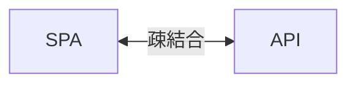
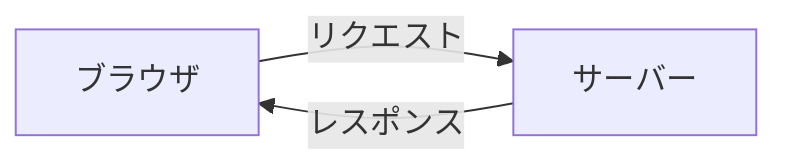
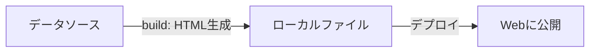

# SPA と SSR と SSG

Webホスティングには特性の異なる３種のタイプがあります。

## SPA - シングルページ・アプリケーション

> 主要フォレームワーク: Vue.js、React

SPAは一番手軽にサイト構築が可能で、初期ロード時にHTML/CSS/JSをダウンロードしてAPIからデータを取りながらレンダリングする手法です。  
SPAはアプリ側とバックエンドAPIの実装を完全に分離することが可能で、負債化しにくく入れ替えがしやすいのも特徴です。  
また、多くの処理をブラウザ側で実行するため、サイト運営側のコストはAPIのコンピューティングリソースのみに抑えることができます。

## SSR - サーバーサイド・レンダリング

> 主要フォレームワーク: Nuxt、Next.js、Laravel、WordPress

SSRはPHP時代から続く技術で、リクエストの度にサーバー側で完全なHTMLを生成してブラウザに返す手法です。  
完全なクラウド型なので全ての処理コストをサイト運営者が負担する仕組みであり、処理に時間がかかるとHTMLが返されず真っ白な画面が表示されてしまうのもSSRの特徴です。  
また、フロント実装の中に唐突に「DB」などの機能クラスが置いてあり、画面表示処理とバックエンド処理が混ざってスパゲティ化しやすいため一度は古の技術として置いてけぼりにされていましたが、最近なぜか Next.js によって勢いを取り戻しています。

SSRはその特性上常に柔軟に完全なHTMLを返せるため、SEOやbotによるクロールには有利なのでコンテンツ数の多いブログサイトなどには適していると言えます。

## SSG（JAMstack） - 静的サイトジェネレーター

> 主要フォレームワーク: VitePress、Nuxt、Next.js、astro

SSGはリポジトリ内のMarkdownファイルやデータベースをソースにして、buildコマンド実行時に静的なHTMLを一気に書き出してデプロイする手法です。  
完全に静的なHTMLをホスティングするだけなので一番安価（ほぼ無料）に公開することができるため、コンテンツ数の少ないドキュメントサイトや個人ブログに適しています。  
ただし、コンテンツが大量にあったり、リアルタイム性を求められるサイトにはマッチしません。  
またその仕組み上、表示速度が圧倒的に速いのでSEOにも効果があります。
